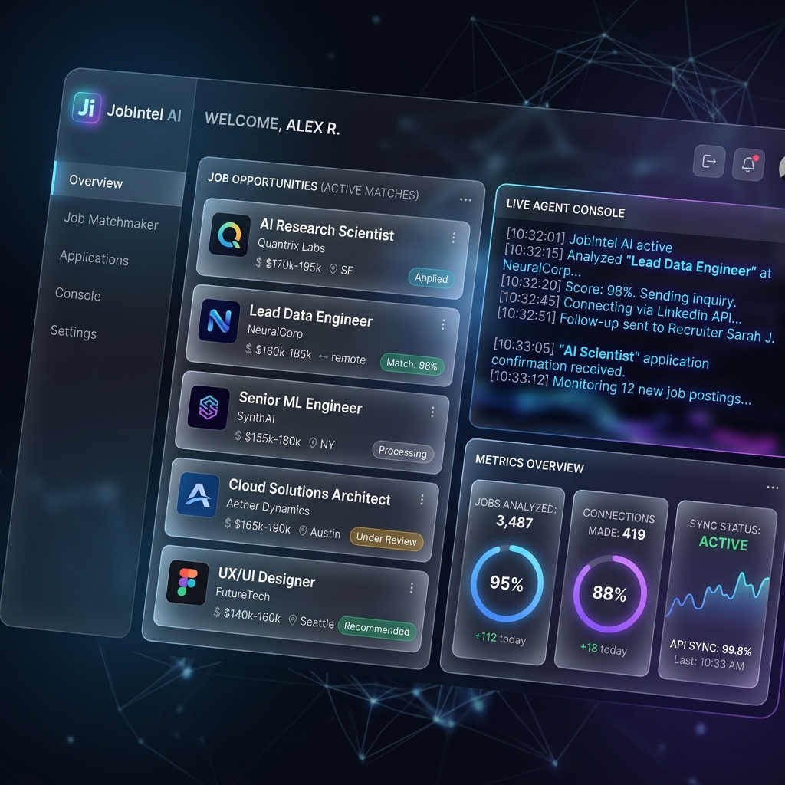
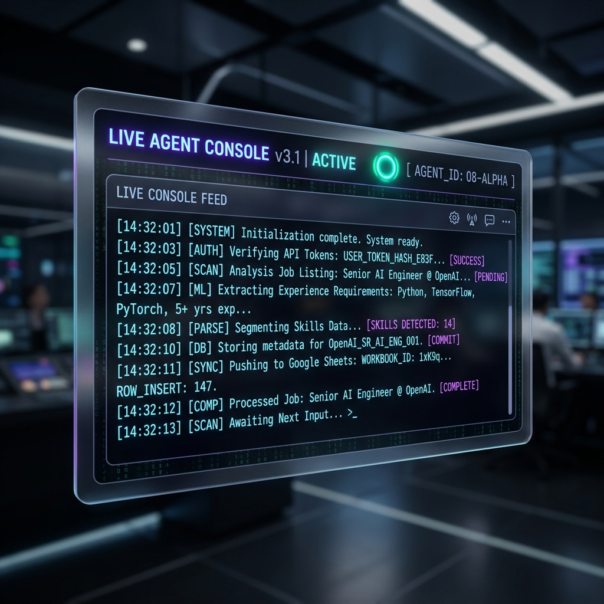
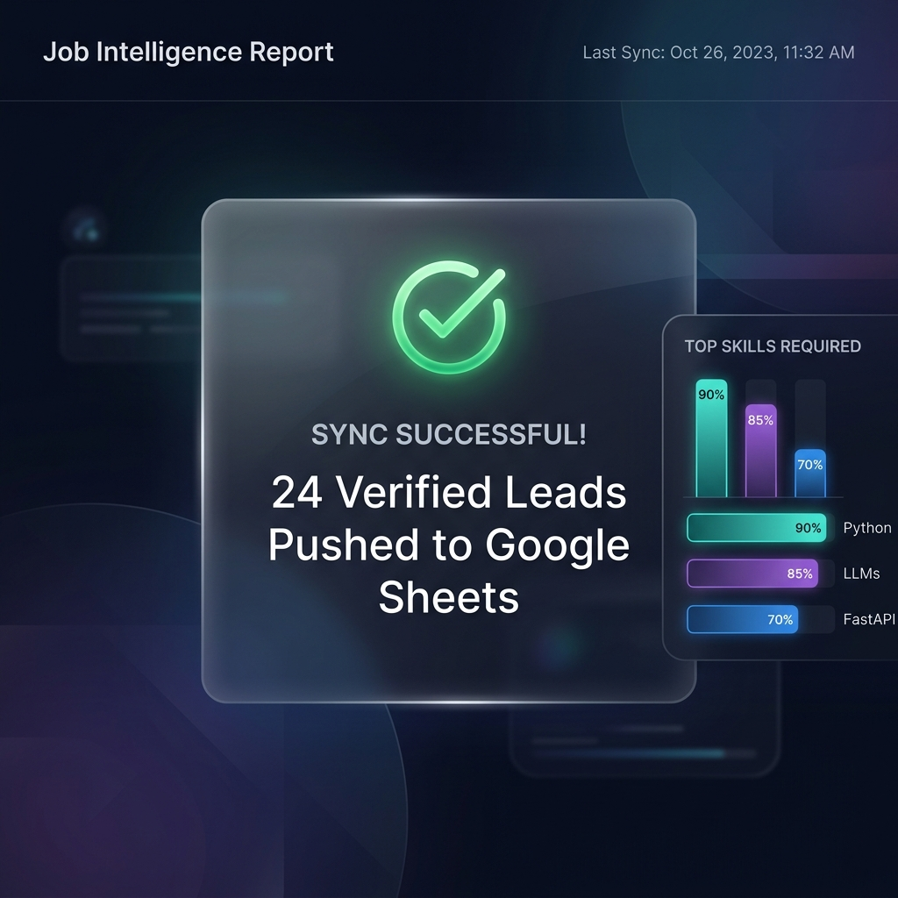
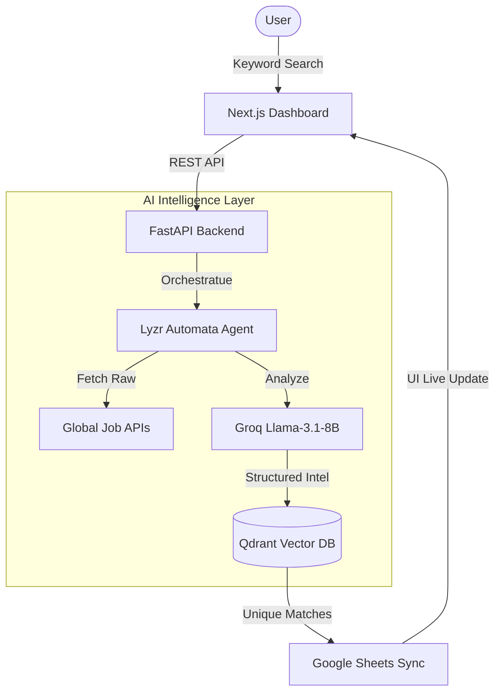

# 🕵️‍♂️ JobIntel AI — Autonomous Job Intelligence Agent

[](https://www.lyzr.ai/)
[](#)
[](#)



**JobIntel AI** is a premium, agentic intelligence platform designed to automate the most tedious parts of the job hunt. Leveraging **Lyzr AI's Automata** orchestration and **Llama-3.1-8B-Instant**'s reasoning, it transforms raw job markers into structured, actionable intelligence.

---

## 🚀 The Vision
Manual job searching is a fragmented and exhausting process. Candidates spend hours scrolling through LinkedIn, manually filtering roles, and tracking them in spreadsheets. Most "automated" tools lack the intelligence to understand context or filter duplicates effectively.

**JobIntel AI** isn't just a scraper; it's an **Autonomous Recruiter Assistant** that thinks, remembers, and organizes.

---

## ✨ Key Features

### 🧠 Neural Extraction & Intelligence
- **Intelligent Parsing**: Extracts Roles, Skills, Experience, and Contact Info using Llama-3.1-8B.
- **Context Awareness**: Understands the "nuance" of job descriptions beyond simple keywords.
- **Smart Enrichment**: Automatically fills in missing details using secondary intelligence lookups.

### 🖥️ Live Agentic Feedback
- **Agentic Console**: A real-time, terminal-style visualization of the AI's "thinking" process. Watch as the agent scans, verifies, and syncs data in real-time.


### 🛡️ Vector Memory & Persistence
- **Zero-Duplicate Core**: Powered by **Qdrant Vector DB** to ensure you never see the same job twice, even if it's listed across different platforms.
- **Semantic Matching**: Identifies similar roles across different titles using high-dimensional embeddings.

### 📊 Professional Data Sync
- **One-Click Pipeline**: Automatically pushes verified, cleaned leads directly to a Google Sheets dashboard.
- **Structured Outputs**: No more messy CSVs; get clean, formatted intelligence reports.


---

## 🛠 Advanced Tech Stack

| Layer | Technology | Purpose |
| :--- | :--- | :--- |
| **Frontend** | `Next.js 14`, `Framer Motion`, `Shadcn UI` | Premium glassmorphism dashboard. |
| **Backend** | `FastAPI (Python 3.11)` | High-performance asynchronous API. |
| **Orchestration**| `Lyzr Automata SDK` | Complex multi-agent workflow management. |
| **AI Reasoning** | `Groq (Llama-3.1-8B-Instant)` | Sub-millisecond latent intelligence. |
| **Vector DB** | `Qdrant Cloud` | Long-term memory and de-duplication. |
| **Integrations** | `Google Sheets API` | Automated data persistence. |

---

## 🏗 System Architecture



---

## ⚙️ Installation & Setup

### 1. Prerequisites
- **Python 3.11+**
- **Node.js 18+**
- API Keys: `GROQ_API_KEY`, `LYZR_API_KEY`, `QDRANT_API_KEY`, `GOOGLE_SHEETS_CREDENTIALS`

### 2. Quick Launch
```bash
# Clone the repository
git clone https://github.com/VishnuVardhanCodes/JobIntel-AI-Agent.git
cd JobIntel-AI-Agent

# Set up Backend
cd backend
pip install -r requirements.txt
python main.py

# Set up Frontend
cd ../frontend
npm install
npm run dev
```

---

## 🤖 AntiGravity: AI Developer Prompt
To interact with this project in a highly efficient manner using an AI assistant like **AntiGravity**, use the following prompt to context-load the agent:

> "You are an expert full-stack developer working on the **JobIntel AI Agent**. This project uses a FastAPI backend, a Next.js frontend, and Lyzr AI for agentic orchestration. The core goal is to extract intelligence from job listings and sync it to Google Sheets while maintaining a vector memory in Qdrant. 
> 
> When editing, maintain the **Premium Glassmorphism** aesthetic of the UI. Ensure all backend changes are optimized for the Lyzr Automata workflow. If you are adding features, consider how the 'Agentic Console' should reflect those changes."

---

## 🏆 Credits & Recognition
Built with 💜 for the **Lyzr Online Hackathon**. 
Special recognition to the **Lyzr** and **Groq** teams for their incredible infrastructure.

**Developed by [Vishnu Vardhan](https://github.com/VishnuVardhanCodes)**
