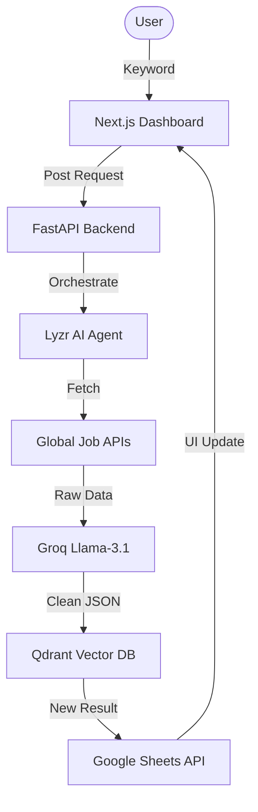

# 🕵️‍♂️ JobIntel AI — Autonomous Job Intelligence Agent

[](https://www.lyzr.ai/)
[](#)
[](#)

**JobIntel AI** is a premium, agentic intelligence platform designed to automate the most tedious parts of the job hunt. Leveraging **Lyzr AI's** orchestration and **Llama-3.1**'s reasoning, it transforms raw job markers into structured, actionable intelligence.

---

## 🚀 The Problem
Manual job searching is a fragmented and exhausting process. Candidates spend hours scrolling through LinkedIn, manually filtering roles, and tracking them in spreadsheets. Most "automated" tools lack the intelligence to understand context or filter duplicates effectively.

## 🎯 Our Solution: JobIntel AI
JobIntel is not just a scraper; it's an **Autonomous Recruiter Assistant**. 
1. **Analyze**: Uses Groq-powered LLMs to deeply understand job descriptions.
2. **Remember**: Uses Qdrant Vector DB to ensure you never see the same job twice.
3. **Organize**: Automatically syncs verified leads to Google Sheets.
4. **Visualize**: Provides a premium, glassmorphism-based dashboard with a live agentic console.

---

## ✨ Key Features

- **🧠 Neural Extraction**: Extracts Roles, Skills, Experience, and Contact Info using Llama-3.1-8B.
- **📡 Real-Time Intelligence**: Live fetching from global job sources via optimized API pipelines.
- **🖥️ Agentic Console**: A real-time terminal-style visualization of the AI's "thinking" process during the pipeline.
- **🛡️ Vector Memory**: Powered by Qdrant to handle smart de-duplication across millions of tokens.
- **📊 Automated Sync**: One-click sync from discovery to a Google Sheets dashboard.
- **💎 Premium UX**: High-end animations with Framer Motion and a sleek dark-mode aesthetic.

---

## 🛠 Tech Stack

| Layer | Technology |
| :--- | :--- |
| **Frontend** | Next.js 14, Tailwind CSS, Framer Motion, Shadcn UI |
| **Backend** | FastAPI (Python 3.11), Uvicorn |
| **AI Orchestration** | Lyzr Automata SDK |
| **LLM Engine** | LiteLLM via Groq (Llama-3.1-8B-Instant) |
| **Vector DB** | Qdrant Cloud |
| **Storage** | Google Sheets API |

---

## ⚙️ Installation & Setup

### 1. Clone the Repository
```bash
git clone https://github.com/VishnuVardhanCodes/JobIntel-AI-Agent.git
cd JobIntel-AI-Agent
```

### 2. Backend Setup
```bash
cd backend
python -m venv venv
source venv/bin/activate  # On Windows: venv\Scripts\activate
pip install -r requirements.txt
```
*Create a `.env` file in the `backend/` directory with your API keys (Groq, Lyzr, Qdrant, Google).*

### 3. Frontend Setup
```bash
cd ../frontend
npm install
npm run dev
```

---

## 🏗 System Architecture



---

## 🏆 Hackathon Credits
Built with 💜 for the **Lyzr Hackathon**. 
Special thanks to the Lyzr and Groq teams for providing the orchestration and inference layers that make this agent possible.

---

**Developed by [Vishnu Vardhan](https://github.com/VishnuVardhanCodes)**
