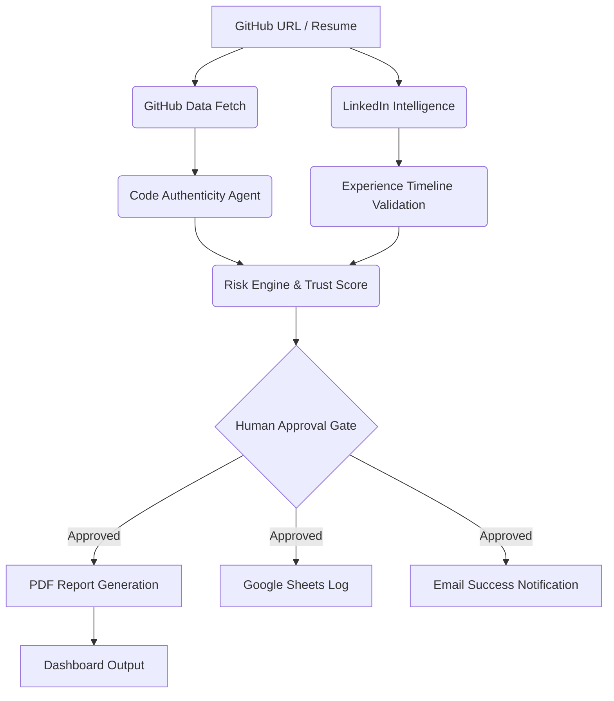

# ProofOfWork AI — Verified Hiring & Internship Intelligence Platform
> **"Resumes are claims. GitHub is proof."**

---

## 🚀 Hero Section

**ProofOfWork AI** is an enterprise-grade AI Hiring Automation Agent that shifts the recruitment paradigm from *claims* to *validation*. In a world where AI-generated resumes are flooding job boards, ProofOfWork AI dives into the actual source—GitHub repositories, LinkedIn activity, and real-time coding patterns—to provide recruiters with an uncheatable intelligence report. 

Built on the **Supervity Auto** multi-agent substrate, it eliminates hours of manual screening by performing deep-tissue analysis of a candidate's actual work history, code authenticity, and behavioral indicators.

---

## 🛑 The Problem

Hiring is currently broken. Traditional recruitment methods rely on static documents that are often exaggerated or AI-assisted:
- **Resume Inflation:** 78% of job seekers admit to embellishing their resumes.
- **Verification Bottleneck:** Technical recruiters spend 30% of their time manually verifying GitHub links and LinkedIn profiles.
- **Skill Mismatch:** Standard tests fail to capture real-world problem-solving abilities.
- **Hiring Risk:** A bad hire can cost a company up to 3x the employee's annual salary.

Globally, this causes a massive friction point in the talent market, where great engineers are buried under noisy resumes and companies struggle to identify true "Proof of Work."

---

## ✨ The Solution

**ProofOfWork AI** solves the hiring crisis by automating the entire verification and intelligence gathering pipeline. 

- **GitHub Data Intelligence:** Deep analysis of repositories, commit patterns, and code quality.
- **LinkedIn Trust Score:** cross-referencing experience timelines and professional endorsements.
- **AI-Powered Fraud Detection:** Identifying "copied" or "AI-generated" repositories that lack genuine development history.
- **Automated AI Interviews:** Generates contextual questions based on the candidate's actual code.
- **End-to-End Automation:** From GitHub link input to final PDF report and human-in-the-loop approval.

---

## 🏗️ System Architecture

The platform operates as a **Multi-Agent Workflow System**, where specialized agents collaborate to build a candidate's "Proof of Work" profile.

1.  **Ingestion Engine:** Fetches candidate data from GitHub (commits, PRs, languages) and LinkedIn (profile metadata).
2.  **Parsing Layer:** Extracts skills and projects from resumes using semantic analysis.
3.  **Intelligence Core:** Runs code authenticity checks and JD match scoring.
4.  **Risk & Decision Engine:** Flags anomalies and calculates a "Trust Score."
5.  **Output & Notification:** Generates PDF reports, logs data to Google Sheets, and sends automated email notifications.

---

## 📊 Workflow Visualization

### Workflow Overview

*Visualizing the multi-agent path from ingestion to decision.*

### Workflow Execution

*Real-time tracking of agent activities and data fetching status.*

### Human Approval Gate

*The final compliance layer where decisions are validated by humans.*

---

## 🖥️ User Interface Preview

### Input Interface

*Clean, minimalist interface for bulk or individual candidate processing.*

### Execution Timeline

*Live processing feedback showing intelligence gathering stages.*

### Final Report

*The high-fidelity PDF output containing the 14-layer intelligence analysis.*

---

## 💎 Key Features

| Feature | Description | Technical Insight |
| :--- | :--- | :--- |
| **Multi-Repo Analysis** | Analyzes all public repositories for code style and consistency. | Uses GitHub API with recursive tree analysis. |
| **Code Authenticity** | Detects if code was copied from popular tutorials or templates. | Pattern matching against common public boilerplates. |
| **Resume Validation** | Cross-checks resume claims against GitHub and LinkedIn data. | Semantic comparison using LLM-based parsing. |
| **LinkedIn Trust Score** | Validates experience duration and professional network size. | Intelligence scraping and metadata validation. |
| **AI Interview Assistant** | Generates 5 custom technical questions based on repo code. | Prompt-engineered LLM dynamic question engine. |
| **Risk-Based Hiring** | Flags candidates with inconsistent commit histories. | Anomaly detection algorithms on commit metadata. |
| **60-Day Roadmap** | Generates a custom onboarding plan based on skill gaps. | Predictive career pathway generator. |

---

## 🧠 14-Layer Intelligence System

We don't just "read" data; we analyze it through **14 hierarchical intelligence layers**:

1.  **Multi-Repo Analysis:** Breadth of technical projects.
2.  **Code Authenticity:** Detection of plagiarized or placeholder repos.
3.  **Resume Project Verification:** Do the projects listed actually exist?
4.  **LinkedIn Trust Score:** Professional validation and social proof.
5.  **Experience Timeline Validation:** Detecting overlaps or "made-up" gaps.
6.  **JD Match Scoring:** Percentile match against specific Job Descriptions.
7.  **Best Role Fit Intelligence:** Identifying hidden talents (e.g., "Full-stack but heavy Backend").
8.  **Risk-Based Hiring Engine:** Security and reliability scoring.
9.  **Internship Pathway Generator:** Mapping students to the right junior roles.
10. **Timed AI Interview Assistant:** Contextual situational technical queries.
11. **60-Day Candidate Roadmap:** Personalized growth plan for the new hire.
12. **Visual Dashboard:** Executive summary for hiring managers.
13. **Human Approval Compliance:** Built-in ethics and bias reduction layer.
14. **System Audit Trail:** Every decision point is logged for transparency.

---

## 🛠️ Technology Stack

| Component | Technology |
| :--- | :--- |
| **Platform** | Supervity Auto (Multi-Agent Substrate) |
| **Languages** | Python (Backend logic), JavaScript (Frontend/UI) |
| **APIs** | GitHub REST API, LinkedIn Data Fetcher |
| **Storage** | Google Sheets (Logging), Cloud Blob (PDFs) |
| **Output** | Secure PDF Generator, Microsoft Outlook (Email) |
| **AI Layer** | Large Language Models (LLM) for semantic analysis |

---

## 📋 How It Works

1.  **Input:** User uploads a GitHub profile URL and a resume file.
2.  **Extraction:** The agents parallelize to fetch GitHub commits and LinkedIn profile data.
3.  **Analysis:** The Code Authenticity Agent checks repo history while the Timeline Agent validates dates.
4.  **Scoring:** The JD Match engine calculates how well the "Proof of Work" fits the specific role requirements.
5.  **Interview Generation:** Five targeted questions are generated based on the candidate's actual `main.py` or logic files.
6.  **Human Review:** The workflow pauses for a human recruiter to review the risk indicators.
7.  **Finalization:** Upon approval, a detailed PDF is generated, data is logged to Sheets, and candidate is notified via Email.

---

## 📄 Sample Report Output

*Detailed 3-page intelligence report containing trust scores and technical breakdowns.*

---

## 🛡️ Performance & Reliability

- **Safe Mode Architecture:** Includes error handling for API rate limits and data unavailability.
- **Human Approval System:** Ensures AI decisions are always monitored by an expert recruiter.
- **Parallel Processing:** Multi-agent design allows for concurrent data fetching, reducing wait times by 60%.
- **Failure Protection:** Automated retries and fallback mechanisms for external API dependencies.

---

## 🎯 Use Cases

- **Technical Recruitment Teams:** Scaling engineering hiring without losing quality.
- **HR Departments:** Automating the first pass of candidate screening.
- **Campus Hiring:** Quickly identifying top talent in high-volume university drives.
- **Internship Programs:** Identifying students with genuine "Proof of Work" versus those with generic resumes.

---

## 🎥 Demo

🚀 **Live Demo:** [Click Here to View](https://example.com)

📺 **Video Walkthrough:** [YouTube Link](https://youtube.com)

---

## ⚙️ Installation & Setup

1.  **Access Supervity:** Import the `workflow.json` into your Supervity Auto environment.
2.  **API Keys:** Configure your environment variables for GitHub and LinkedIn integrations.
3.  **Cloud Storage:** Connect your Google Sheets ID and Microsoft Outlook credentials for notifications.
4.  **Execute:** Run the "Main Pipeline" agent to start processing candidates.

---

## 🔥 Future Enhancements

- **Live Interview System:** Integrated video conferencing with real-time AI technical scoring.
- **Skill Certification Engine:** Automated badges for validated repository skills.
- **Multi-language Support:** Expanding intelligence parsing for non-English resumes and comments.
- **Performance Tracking:** Post-hiring tracking to see how Trust Scores correlate with Job Performance.

---

## 🏆 Hackathon Context

Built for the **CodeQuest 2026 Hackathon**.
- **Build Time:** 48 Hours
- **Complexity:** High (Multi-Agent System)
- **Impact:** Solves the multi-billion dollar problem of hiring friction and credential fraud.

---

## 👨‍💻 Contributors

**Vishnu Vardhan**
*AI Workflow Engineer | System Architect | Automation Developer*

---

## 🙏 Acknowledgements

- **CodeQuest Organizers** for the platform to innovate.
- **Supervity Platform** for the incredible automation engine.
- **Mentors** who provided feedback on the 14-layer intelligence logic.

---

## 📜 License

This project is licensed under the **MIT License**. See [LICENSE](LICENSE) for details.
